# Architecture And Data Flow

## Runtime Topology

```mermaid
flowchart TD
    BG[entrypoints/background.ts]

    BG --> BAPP[src/app/background/create-background-services.ts]
    BG --> BMSG[src/app/background/background-message-bus.ts]

    BAPP --> MON[src/features/monitoring/*]
    BAPP --> PUB[src/features/monitoring/job-batch-publisher.ts]
    BAPP --> PROP[src/features/proposals/*]
    BAPP --> STORE[src/shared/storage/extension-storage.ts]
    BAPP --> NOTIF[src/features/notifications/service.ts]
    BAPP --> AUDIO[src/features/notifications/audio-service.ts]
    BAPP --> OFF[src/shared/browser/offscreen/manager.ts]
    BAPP --> PHP[src/platforms/monitoring-html-parser.ts]
    BAPP --> PMOD[src/platforms/registry.ts]
    BAPP --> SIG[src/features/realtime/signalr-manager.ts]

    SIG --> SIGRED[src/features/realtime/signalr-reducer.ts]
    SIG --> SIGEFF[src/features/realtime/signalr-effects.ts]

    POP[src/app/popup/index.ts] --> MSG[src/app/background/background-messages.ts]
    POP --> REPOS[src/shared/browser/browser-repositories.ts]

    DASH[src/app/dashboard/*] --> MSG
    DASH --> REPOS

    MC[entrypoints/mostaql.content/index.ts] --> CBOOT[src/app/content/bootstrapPlatformContent.ts]
    MC --> CAUTO[src/app/content/bootstrapPlatformAutofill.ts]
    MC --> CDEPS[src/app/content/createPlatformContentServices.ts]
    MC --> MADAPTER
    MC --> REPOS

    KC[entrypoints/khamsat.content/index.ts] --> CBOOT
    KC --> CAUTO
    KC --> CDEPS
    KC --> KADAPTER
    KC --> REPOS

    NC[entrypoints/nafezly.content/index.ts] --> CBOOT
    NC --> CAUTO
    NC --> CDEPS
    NC --> NADAPTER
    NC --> REPOS

    KFC[entrypoints/kafiil.content/index.ts] --> CBOOT
    KFC --> CAUTO
    KFC --> CDEPS
    KFC --> KFADAPTER
    KFC --> REPOS

    PMOD --> MADAPTER[src/platforms/mostaql/adapter.ts]
    PMOD --> KADAPTER[src/platforms/khamsat/adapter.ts]
    PMOD --> NADAPTER[src/platforms/nafezly/adapter.ts]
    PMOD --> KFADAPTER[src/platforms/kafiil/adapter.ts]
```

## Background Boot Sequence

`entrypoints/background.ts` is a thin WXT composition root.

It delegates:

- dependency construction to `src/app/background/create-background-services.ts`
- runtime message transport registration to `src/app/background/background-message-bus.ts`

On startup the background app:

1. creates storage, notifications, offscreen, audio, monitoring parser, monitoring adapters, AI providers, and the SignalR manager
2. creates proposal-generation and runtime handler services
3. runs:
    - `storage.ensureDefaults()`
    - `offscreen.bootstrap()`
    - `signalr.bootstrap(reason)`
4. registers lifecycle listeners for:
    - `runtime.onInstalled`
    - `runtime.onStartup`
    - `alarms.onAlarm`
    - `runtime.onMessage`
    - notification click handlers

The background layer no longer owns platform registry wiring, notification policy duplication, or raw SignalR state transitions inline.

## Monitoring Control Plane

Monitoring is driven by:

- `src/features/monitoring/run-polling-cycle.ts`
- `src/features/monitoring/process-realtime-job-batch.ts`
- `src/features/monitoring/job-batch-publisher.ts`
- `src/features/realtime/signalr-manager.ts`

`signalr-manager.ts` decides between:

- disabled
- polling-only
- SignalR-first with polling fallback

That decision depends on:

- `settings.systemEnabled`
- `settings.notificationMode`
- whether any enabled platform module has `realtime.supportsSignalR === true`

The manager still owns connection orchestration, but state logic is now split into:

- `src/features/realtime/signalr-reducer.ts`
  pure state transitions
- `src/features/realtime/signalr-effects.ts`
  alarm scheduling and clearing side effects

## Realtime Job Ingest

Realtime job batches flow through:

- `src/features/monitoring/job-records.ts`
- `src/features/monitoring/process-realtime-job-batch.ts`
- `src/features/monitoring/job-batch-publisher.ts`

The realtime path:

1. normalizes incoming hub payloads into `JobRecord`
2. applies platform-enabled and filter checks
3. ingests unseen jobs into normalized storage
4. runs the shared publish policy

The shared publish policy is where these decisions now live:

- quiet-hours suppression
- whether notifications are enabled
- whether notification audio should play
- result shaping for polling vs SignalR callers

The realtime path does not hydrate project HTML after the hub payload arrives.

## Polling Job Ingest

The polling path is owned by:

- `src/features/monitoring/run-polling-cycle.ts`
- `src/features/monitoring/fetch-platform-html.ts`
- `src/features/monitoring/job-batch-publisher.ts`
- `src/platforms/registry.ts`
- `src/platforms/*/monitoring.ts`
- `src/platforms/*/html-parser.ts`

The polling path:

1. resolves enabled platform monitoring adapters from `registry.ts`
2. resolves feed URLs from each adapter
3. fetches listing HTML with `credentials: 'omit'`
4. parses shallow `JobRecord[]` through the platform parser contract
5. ingests unseen jobs
6. hydrates new jobs from project/detail HTML
7. re-applies filters to the hydrated records
8. merges enriched jobs back into recent storage
9. runs the shared publish policy

The background layer never parses platform HTML inline. It always delegates through the monitoring adapter and the offscreen/local HTML parsing bridge.

## Storage Model

There are three storage-facing layers worth keeping separate:

- `src/shared/browser/storage-client.ts`
  the raw `browser.storage.local` boundary
- `src/shared/storage/extension-storage.ts`
  normalized storage access for settings, monitoring, runtime, and notification payloads
- `src/features/*/repository.ts`
  domain-focused repositories for popup, dashboard, content scripts, backup, prompts, proposals, and tracking

Proposal bridge/autofill state is handled through:

- `src/shared/storage/modules/proposal-state-storage.ts`

Snapshot import/export normalization is handled through:

- `src/shared/storage/snapshot-state.ts`
- `src/features/backup/repository.ts`

## Platform Layer

Platform abstractions live in:

- `src/platforms/contracts.ts`
- `src/platforms/registry.ts`
- `src/platforms/monitoring-html-parser.ts`
- `src/platforms/platform-ids.ts`

Each supported platform module provides:

- a monitoring adapter factory
- a monitoring HTML parser
- realtime capability metadata

Content adapters are exported from `src/platforms/<platform>/index.ts` and imported directly by the matching content entrypoint so background/offscreen bundles do not pull page UI modules.

Current concrete implementations live in:

- `src/platforms/mostaql/*`
- `src/platforms/khamsat/*`
- `src/platforms/nafezly/*`
- `src/platforms/kafiil/*`

There are no longer separate content, monitoring, and parser registries to keep in sync.

## Content Runtime

Platform page entrypoints compose:

- browser repositories
- `PlatformContentServices`
- the selected platform adapter imported from `src/platforms/<platform>/index.ts`

The content runtime then uses:

- `src/app/content/bootstrapPlatformContent.ts`
- `src/app/content/bootstrapPlatformAutofill.ts`

Key runtime rules:

- services are required, not optional
- contributions return `mounted` or `deferred`
- mounted contribution IDs are tracked separately from disposers
- mutation-driven retries only rerun deferred contributions

## Runtime Messages

Popup, dashboard, and content scripts talk to the background through:

- `src/app/background/background-messages.ts`

The background implements the contract in:

- `src/app/background/background-runtime-handlers.ts`

Important message actions include:

- `checkNow`
- `debugFetch`
- `generateProposal`
- `downloadZip`
- `updateAlarm`
- `reconnectSignalR`
- `disconnectSignalR`

Responses are returned through an explicit success/error transport envelope instead of ad hoc `undefined` handling.
