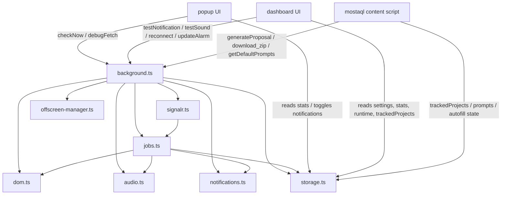

# Architecture And Data Flow

## Runtime Topology

## Background Boot Sequence

`entrypoints/background.ts` is the orchestration root.

On bootstrap it:

1. Creates `storage`, `notifications`, `offscreen`, `audio`, `dom`, and `signalr` singletons.
2. Calls `storage.ensureDefaults()`.
3. Calls `offscreen.bootstrap()`.
4. Calls `signalr.bootstrap(reason)`.
5. Registers:
   - `runtime.onInstalled`
   - `runtime.onStartup`
   - `alarms.onAlarm`
   - `runtime.onMessage`
   - notification click handlers

The background script never parses HTML or plays audio directly through ad-hoc code paths. Both duties go through the offscreen/local abstraction.

## Polling And SignalR Control Plane

`src/core/signalr.ts` decides whether the extension should be:

- disabled
- polling-only
- SignalR-first with polling fallback

The decision comes from `settings.systemEnabled` and `settings.notificationMode`.

Recurring alarms are then synchronized:

- `jobs:poll`
- `signalr:health`
- `signalr:lease`
- `signalr:reconnect`

Important implementation detail: the polling alarm still exists while SignalR is enabled so the extension can keep progressing when the MV3 worker is suspended or the live socket drops.

## Job Ingest: SignalR Path

### 1. Socket connection

`createSignalRManager()` connects to:

- `settings.signalrServerUrl`, or
- `DEFAULT_SIGNALR_URL` = `https://frelancia.runasp.net/jobNotificationHub`

The SignalR client enables these transports:

- WebSockets
- Server-Sent Events
- Long Polling

### 2. Incoming event

The manager listens for the hub event:

- `NewJobsDetected`

The payload can be either:

- `{ jobs: [...] }`
- a raw array of jobs

Each item is normalized through `normalizeJobRecord()`.

### 3. First-pass filtering

`processRealtimeJobBatch()` applies `applyFilters()` before storage ingest. The filter rules are:

- `minBudget`
- `minHiringRate`
- `keywordsInclude`
- `keywordsExclude`
- `maxDuration`
- `minClientAge`

For SignalR, this first pass uses whatever fields already exist on the hub payload. There is no follow-up hydration request in the realtime path.

### 4. Cache write

Filtered jobs are passed to `storage.ingestJobs(candidates)`.

That method:

- deduplicates against `seenJobs`
- appends new IDs to `seenJobs`
- merges records into `recentJobs`
- trims `seenJobs` to `MAX_SEEN_JOBS = 500`
- trims `recentJobs` to `MAX_RECENT_JOBS = 50`
- updates `stats.lastCheck`
- increments `stats.todayCount`

### 5. Quiet-hours suppression

If quiet hours are enabled and the current clock falls inside the configured interval, notifications are suppressed after the storage write. The jobs are still cached locally.

### 6. Notification + sound

If notifications are enabled:

- `notifications.showJobsNotification(newJobs)` creates one browser notification
- `audio.playNotification()` plays the two-tone alert if `settings.sound` is enabled

The notification payload is also persisted under:

- `notification:<notificationId>` -> `{ url, jobId }`

When the user clicks the notification, the extension opens the stored job URL in a new tab.

## Job Ingest: Polling Path

### 1. Feed selection

`runPollingCycle()` resolves feeds from `MOSTAQL_FEEDS`:

- `all`
- `development`
- `ai`

If `settings.all !== false`, only the all-projects feed is polled. Otherwise the enabled category feeds are polled individually.

### 2. Feed fetch

Each feed is requested as HTML with:

- `GET`
- `credentials: 'omit'`
- `cache: 'no-store'`
- a `_cb=<timestamp>` cache-buster

If the response contains Cloudflare challenge markers, the batch is discarded.

### 3. Feed parse

HTML parsing goes through `dom.parseJobs(html)`, which extracts jobs from:

- `.list-group-item a[href*="/project/"]`
- table rows with `a[href*="/project/"]`
- a final fallback scan of all `a[href*="/project/"]`

This produces shallow `JobRecord` objects.

### 4. Initial ingest

The union of all feed jobs is written through `storage.ingestJobs([...feedJobs.values()])`.

At this point:

- IDs are deduplicated
- `seenJobs` is updated
- `recentJobs` is updated with shallow job data
- `stats` is updated
- `runtime.lastPollingReason` is patched

### 5. Project hydration

Only newly seen jobs are hydrated.

For each new job, the background fetches the job detail page and parses:

- `status`
- `communications`
- `hiringRate`
- `description`
- `duration`
- `budget`
- `registrationDate`

### 6. Second-pass filtering

The hydrated record is filtered again with `applyFilters()`.

This matters because some filters depend on fields that are usually unavailable on the shallow feed payload:

- `description`
- `duration`
- `hiringRate`
- `registrationDate`

### 7. Cache enrichment

`storage.mergeRecentJobs(hydratedJobs)` upgrades the existing `recentJobs` cache with the more complete hydrated records.

### 8. Quiet-hours / notification

As in the SignalR path:

- quiet hours suppress delivery after caching
- notifications create one browser notification
- sound is optional

## Filter Behavior

`applyFilters()` is deterministic and fully local:

- Budget: extracts all numeric values from the budget string and compares the maximum value against `minBudget`
- Hiring rate: parses the first numeric value unless the text contains `بعد`
- Include keywords: comma-separated, matched against `title + description`
- Exclude keywords: comma-separated, matched against `title + description`
- Duration: parses day counts, with explicit handling for `يوم واحد`
- Client age: parses Arabic month names from `registrationDate`

Quiet hours are not part of `applyFilters()`. They are enforced later as a notification-delivery rule.

## Persistent Storage Model

The normalized storage snapshot is:

- `settings`
- `seenJobs`
- `recentJobs`
- `stats`
- `trackedProjects`
- `prompts`
- `proposalTemplate`
- `notificationsEnabled`
- `runtime`

Additional transient keys are written outside the snapshot helper:

- `pendingChatGptPrompt`
- `mostaql_pending_autofill`
- `notification:<id>`

## UI Consumers

### Popup

The popup reads:

- `stats`
- `seenJobs`
- `notificationsEnabled`

It can also send:

- `checkNow`
- `debugFetch`

### Dashboard

The dashboard reads:

- `settings`
- `stats`
- `prompts`
- `proposalTemplate`
- `trackedProjects`
- `runtime.signalr`

It can send:

- `updateAlarm`
- `reconnectSignalR`
- `disconnectSignalR`
- `testNotification`
- `testSound`

### Mostaql content script

The Mostaql content script does not ingest jobs. It works on top of cached state and page DOM:

- adds tracking controls
- reads and writes `trackedProjects`
- queues `mostaql_pending_autofill`
- requests proposal generation
- requests ZIP export generation
